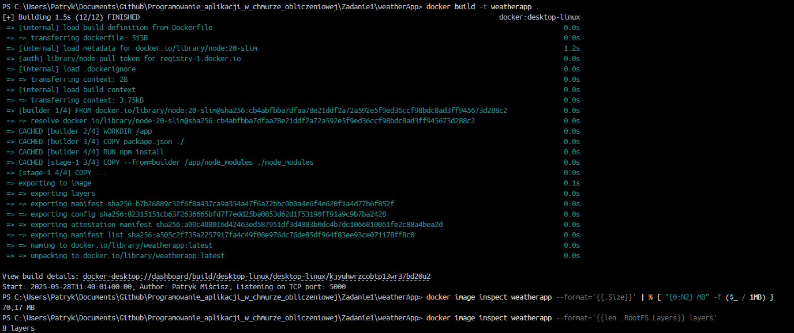

### Link do storny z API

https://openweathermap.org

### W pliku .env należy podać swój klucz api ze strony np:

7beb4495a2c6f9a644c42f258f30c31f

## 1. Polecenia do obsługi obrazu i kontenera

### a. Budowanie obrazu:

```bash
docker build -t weatherapp .
```

### b. Uruchomienie obrazu:

```bash
docker run -d -p 5000:5000 --env-file .env --name weatherApp weatherapp
```

### c. sprawdzenie logów:

```bash
docker logs weatherApp
```

### wynik:

```bash
> weather-app@1.0.0 start
> node app.js

Author: Patryk Miścisz, Listening on TCP port: 5000
```

### d. sprawdzenie rozmiaru:

```bash
docker image inspect weatherapp --format='{{.Size}}' | % { "{0:N2} MB" -f ($_ / 1MB) }
```
### wynik:

```bash
70,17 MB
```


### e. sprawdzenie ilości warstw:

```bash
docker image inspect weatherapp --format='{{len .RootFS.Layers}} layers'
```
### wynik:

```bash
8 layers
```

## 3. Screenshots

### Widok Strony


### Widok w docker desktop

