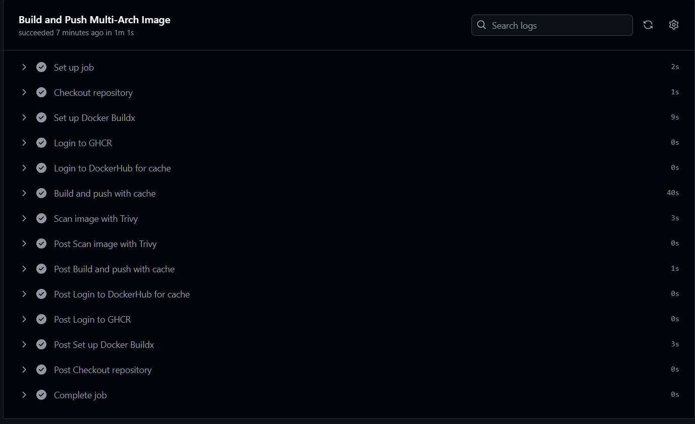
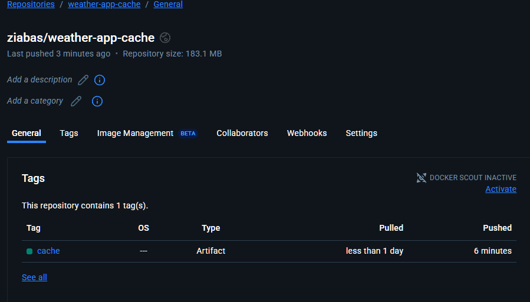

## 1. Polecenia do obsługi obrazu i kontenera

### a. clonowanie repozytorium:
```bash
git clone https://github.com/pmiscisz/Zadanie2.git
```
### a. Budowanie obrazu:

```bash
docker build -t weather-app .
```

### b. Uruchomienie obrazu:

```bash
docker run -d -p 5000:5000 --env-file .env weather-app
```

## 2. Zadanie
### a. Obraz wspierać ma dwie architektury: linux/arm64 oraz linux/amd64.
```yml
#Fragment kodu pliku build-and-push.yml:
platforms: linux/amd64,linux/arm64
```
### b. Wykorzystywane mają być (wysyłanie i pobieranie) dane cache (eksporter: registry oraz backend-u registry w trybie max). Te dane cache powinny być przechowywane w dedykowanym, publicznym repozytorium autora na DockerHub.
```yml
#Fragment kodu pliku build-and-push.yml:
 tags: ${{ env.IMAGE_NAME }}:latest
        cache-from: type=registry,ref=${{ env.CACHE_REPO }}:cache
        cache-to: type=registry,ref=${{ env.CACHE_REPO }}:cache,mode=max
``` 
### c. Ma być wykonany test CVE obrazu, który zapewni, że obraz zostanie przesłany do publicznego repozytorium obrazów na GitHub tylko wtedy gdy nie będzie zawierał zagrożeń sklasyfikowanych jako krytyczne lub wysokie.
```yml
#Fragment kodu pliku build-and-push.yml:
  - name: Scan image with Trivy
      uses: aquasecurity/trivy-action@master
      with:
        image-ref: ${{ env.IMAGE_NAME }}:latest
        format: 'table'
        exit-code: '0'
        vuln-type: 'os,library'
        severity: 'CRITICAL,HIGH'
``` 
## 3. Screenshots

### Łańcuch GHAction



### Publiczne repozytorium dockerhub przechowujące cache


